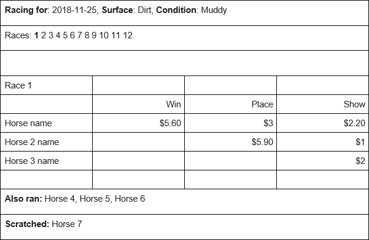

# CF Toteboard

Each race shows:

- the "WIN" (finish place of 1) horse and payoff values
- the "PLACE" (finish place of 2) horse and payoff values
- the "SHOW" (finish place of 3) horse and their &quot;payoff&quot; values
- the "also rans" who did not finish in the top 3
- the "scratched" horses with a scratch value of true

## API

Contains all the races to display:

[/tracks/TRK/race-days.json](/tracks/TRK/race-days.json)

Contains details for each completed race

[/tracks/TRK/race-days/2018-11-25/races/1.json](/tracks/TRK/race-days/2018-11-25/races/1.json)

[/tracks/TRK/race-days/2018-11-25/races/2.json](/tracks/TRK/race-days/2018-11-25/races/2.json)

And so on and so forth (there are about 50 races across a few days)

## Time

| Task                                                  | Time  |
| ----------------------------------------------------- |:-----:|
| Researched/selected project framework.                |`1h00m`|
| Learned/experimented with Symfony.                    |`2h00m`|
| Established basic data model through API exploration. |`0h30m`|
| Set up basic API consumer (WIP).                      |`0h30m`|
| Set up basic Race Day & Race selection.               |`1h00m`|
| Add Race entry processing to API consumer and board.  |`1h00m`|
| Mark up and style frontend.                           |`0h30m`|
| Add basic API call data "caching".                    |`0h30m`|
| **Total**                                             |**`7h00m`**|
